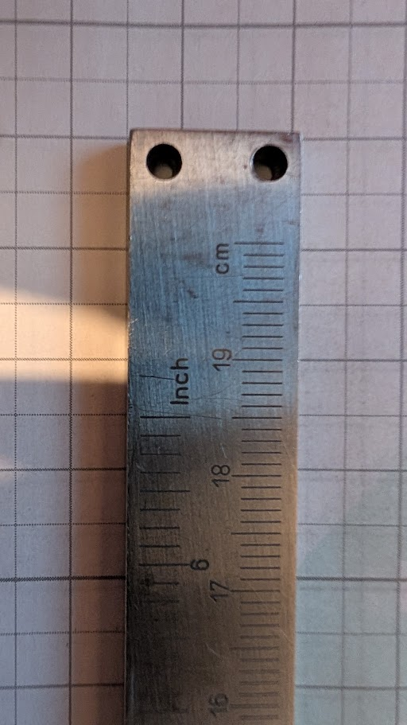

# 3D Printing Models

A collection of ASCII STL models for the Anycubic Kobra S1 Combo + ACE Pro (250 × 250 mm build plate).

## Models

| File | Description |
|------|-------------|
| `models/wedge_100x20x40.stl` | 100 × 20 × 40 mm wedge |
| `models/lineal-clip-kappe.stl` | Snap-fit clip cap for the two holes at the end of a steel ruler ([see example](#example-from-photo-to-printable-stl)) |
| `models/duschscharnier_ersatz.stl` | Shower-door hinge replacement body generated from `scripts/duschscharnier_ersatz.py` |
| `models/zylinder_scheibe_2026_2027.stl` | Cylindrical/washer-style reference part |

## Setup

Python tooling for parametric model generation lives in a project-local virtual environment:

```powershell
python -m venv .venv
.\.venv\Scripts\python.exe -m pip install -r requirements.txt
```

Generator scripts live in `scripts/` and write their output to `models/`:

```powershell
.\.venv\Scripts\python.exe scripts\lineal_clip_kappe.py
```

## Example: From Photo to Printable STL

This walkthrough shows how the skills in this repo turn a photo plus a couple of
measurements into a validated, printable STL. The example produces
`models/lineal-clip-kappe.stl` — a small cap that clicks into the two holes at the
end of a steel ruler.

### 1. Provide a photo with a scale reference

Place the object on graph paper (or next to a ruler/coin) so the agent can derive a
scale. Here the 5 mm grid **and** the ruler's own cm scale give two independent
references:



Then describe the intent, e.g.:

> Create an STL file:
> - the object should be a narrow rectangle that sits on top of the two holes
> - it should have two bumps that fit exactly into the holes so it clicks in

### 2. The agent derives measurements from the image

The `stl-from-image-measurements` skill scales the image and reports what is measured
versus inferred:

| Dimension | Value | Source |
|-----------|-------|--------|
| Ruler width | 14.5 mm | image scaling (5 mm grid ≈ 14.4 px/mm) |
| Hole diameter | 2.5 mm | image scaling |
| Hole spacing (centre-to-centre) | 9.1 mm | image scaling |
| Hole centre from top edge | 3.2 mm | image scaling |
| Material thickness | 2.0 mm | **user supplied** (not visible from a top view) |

### 3. Confirm the fit-critical values

Anything that controls a fit is confirmed before geometry is built. In this run the
agent asked three targeted questions:

1. Are the estimated hole diameter / spacing / width correct? → *accept estimates*
2. How thick is the ruler? → *2.0 mm*
3. How should the bumps engage? → *snap hooks with a retaining lip (audible click)*

### 4. Geometry is generated as a parametric script

`scripts/lineal_clip_kappe.py` builds the solid with `trimesh` + `manifold3d` booleans,
so every dimension stays editable:

- Plate: 14.5 × 7.0 × 2.0 mm
- Peg shaft ⌀2.30 mm = 2.5 mm hole − 0.20 mm press-fit clearance
- Shaft length 2.0 mm (= material thickness), then a ⌀3.00 mm barb with a 0.35 mm retaining ledge
- 1.4 mm lead-in cone (≈34°) for easy insertion
- 0.6 mm compliance slot per peg → two 0.85 mm spring legs so it actually snaps

### 5. Validate and preview

The `validate-stl-mesh` checks must all pass before the file is considered done:

```
facets: 972
extents: [14.5, 7.0, 5.4]
watertight: True
winding_consistent: True
euler: 2
degenerate: 0
volume_mm3: 217.761
```

The result is then opened in the new STL Canvas SPA (GitHub Pages), which uses
the same renderer as the GitHub Copilot App canvas extension. As the main
showcase model, use `models/duschscharnier_ersatz.stl` with the **Normal**
shader:


### 6. Print orientation

The model is exported in its print orientation: plate flat on the bed, snap pegs
pointing up (+Z). No supports are needed — the only overhang is the 0.35 mm retaining
ledge. In use the part is flipped and pressed onto the ruler.

### 7. Iterate

If the fit is too tight or too loose, adjust `HOLE_DIA` / `PRESS_CLEAR` in
`scripts/lineal_clip_kappe.py` and re-run the script instead of editing the mesh.

## Agent Skills

| Skill | Description |
|-------|-------------|
| `anycubic-kobra-s1-ace-pro-profile` | Printer defaults and constraints (bed size, nozzle, temperatures, wall minimums) for the Anycubic Kobra S1 Combo + ACE Pro. Referenced by other skills when authoring or editing STL files. |
| `create-ascii-stl` | Generates new ASCII STL files using print-safe defaults. Collects dimensions, material, use case, and multi-color requirements before producing any geometry. |
| `edit-stl-transform` | Edits existing STL geometry: scale, rotate, translate, merge, split, and origin alignment — while preserving manifold/watertight topology. |
| `stl-create-edit-interview` | Guided interview run before creating or editing STLs. Determines wall strategy, mesh pattern, infill strategy, and fit intent one question at a time. |
| `stl-from-image-measurements` | Creates or edits STLs from user photos plus measurements: identifies the object, researches existing models, derives scale from reference objects, and validates against printer constraints. |
| `validate-stl-mesh` | Validates an STL for manifold correctness and FDM printability: syntax, triangle count, watertight topology, normal consistency, and bed-fit. |

## Coordinate Convention

Models support both placement conventions on the 250 × 250 mm bed:

- **Center-origin** — XY target `(0, 0)`
- **Corner-origin** — XY target `(125, 125)`

Convention is auto-detected from coordinates: negative XY implies center-origin, otherwise corner-origin. When ambiguous, corner-origin is used to match common slicer build-plate coordinates.
