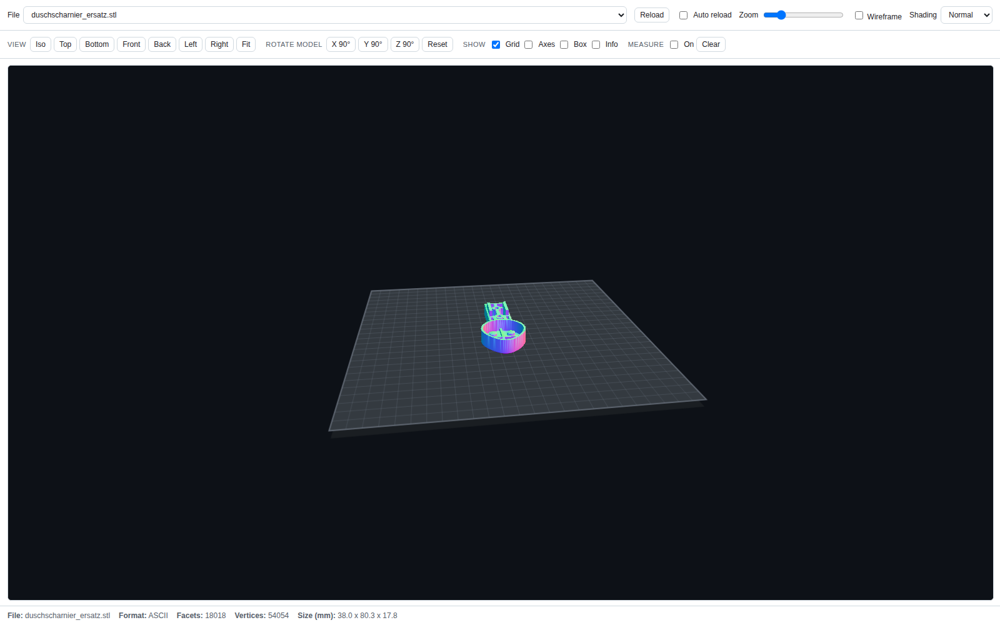

# 3D Printing Models

A collection of ASCII STL models for the Anycubic Kobra S1 Combo + ACE Pro (250 × 250 mm build plate).

## Models

| File | Description |
|------|-------------|
| `models/wedge_100x20x40.stl` | 100 × 20 × 40 mm wedge |
| `models/lineal-clip-kappe.stl` | Snap-fit clip cap for the two holes at the end of a steel ruler ([see example](#example-from-photo-to-printable-stl)) |
| `models/duschscharnier_ersatz.stl` | Shower-door hinge replacement body generated from `scripts/duschscharnier_ersatz.py` |
| `models/waeschespinne-reduzierring-60-43.stl` | ASA reducer ring for a 60 mm sleeve and 43 mm laundry-line pole |
| `models/zylinder_scheibe_2026_2027.stl` | Cylindrical/washer-style reference part |
| `models/lampe-5-rahmen.3mf` | Multi-material frame for the 240 mm number-5 wall lamp |
| `models/lampe-5-leuchtflaechen.stl` | All four translucent lamp panels arranged together on the 250 × 250 mm bed |

## Setup

Python tooling for parametric model generation lives in a project-local virtual environment:

```powershell
python -m venv .venv
.\.venv\Scripts\python.exe -m pip install -r requirements.txt
```

Generator scripts live in `scripts/` and write their output to `models/`:

```powershell
.\.venv\Scripts\python.exe scripts\lineal_clip_kappe.py
```

## Example: From Photo to Printable STL

This walkthrough shows how the skills in this repo turn a photo plus a couple of
measurements into a validated, printable STL. The example produces
`models/lineal-clip-kappe.stl` — a small cap that clicks into the two holes at the
end of a steel ruler.

### 1. Provide a photo with a scale reference

Place the object on graph paper (or next to a ruler/coin) so the agent can derive a
scale. Here the 5 mm grid **and** the ruler's own cm scale give two independent
references:


Then describe the intent, e.g.:

> Create an STL file:
> - the object should be a narrow rectangle that sits on top of the two holes
> - it should have two bumps that fit exactly into the holes so it clicks in

### 2. The agent derives measurements from the image

When several reference photos exist, the agent first builds a numbered contact sheet
so it can pick the right photo instead of opening all of them at full resolution:

```powershell
.\.venv\Scripts\python.exe scripts\make_contact_sheet.py model-sources
```

This writes `model-sources/_index.png` plus an index-to-path legend; measurements are
then taken from the full-resolution tiles that actually show the feature.

Once a model is finished, the raw reference photos are deleted and only the contact
sheet is kept, renamed after the model, under `model-sources/archiv/`
(see `model-sources/archiv/README.md` for the tile-to-file legend).

The `stl-from-image-measurements` skill scales the image and reports what is measured
versus inferred:

| Dimension | Value | Source |
|-----------|-------|--------|
| Ruler width | 14.5 mm | image scaling (5 mm grid ≈ 14.4 px/mm) |
| Hole diameter | 2.5 mm | image scaling |
| Hole spacing (centre-to-centre) | 9.1 mm | image scaling |
| Hole centre from top edge | 3.2 mm | image scaling |
| Material thickness | 2.0 mm | **user supplied** (not visible from a top view) |

### 3. Confirm the fit-critical values

Anything that controls a fit is confirmed before geometry is built. In this run the
agent asked three targeted questions:

1. Are the estimated hole diameter / spacing / width correct? → *accept estimates*
2. How thick is the ruler? → *2.0 mm*
3. How should the bumps engage? → *snap hooks with a retaining lip (audible click)*

### 4. Geometry is generated as a parametric script

`scripts/lineal_clip_kappe.py` builds the solid with `trimesh` + `manifold3d` booleans,
so every dimension stays editable:

- Plate: 14.5 × 7.0 × 2.0 mm
- Peg shaft ⌀2.30 mm = 2.5 mm hole − 0.20 mm press-fit clearance
- Shaft length 2.0 mm (= material thickness), then a ⌀3.00 mm barb with a 0.35 mm retaining ledge
- 1.4 mm lead-in cone (≈34°) for easy insertion
- 0.6 mm compliance slot per peg → two 0.85 mm spring legs so it actually snaps

### 5. Validate and preview

The `validate-stl-mesh` checks must all pass before the file is considered done:

```
facets: 972
extents: [14.5, 7.0, 5.4]
watertight: True
winding_consistent: True
euler: 2
degenerate: 0
volume_mm3: 217.761
```

The result is then opened in the new STL Canvas SPA (GitHub Pages), which uses
the same renderer as the GitHub Copilot App canvas extension — shown here with
the **Normal** shader and fully zoomed to the model:



### 6. Print orientation

The model is exported in its print orientation: plate flat on the bed, snap pegs
pointing up (+Z). No supports are needed — the only overhang is the 0.35 mm retaining
ledge. In use the part is flipped and pressed onto the ruler.

### 7. Iterate

If the fit is too tight or too loose, adjust `HOLE_DIA` / `PRESS_CLEAR` in
`scripts/lineal_clip_kappe.py` and re-run the script instead of editing the mesh.

## Agent Skills

| Skill | Description |
|-------|-------------|
| `anycubic-kobra-s1-ace-pro-profile` | Printer defaults and constraints (bed size, nozzle, temperatures, wall minimums) for the Anycubic Kobra S1 Combo + ACE Pro. Referenced by other skills when authoring or editing STL/3MF outputs. |
| `create-ascii-stl` | Generates new printable geometry with print-safe defaults. Collects dimensions, material, use case, and material/color-semantics intent before producing geometry; enforces 3MF when distinct material/color regions must be preserved. |
| `edit-stl-transform` | Edits existing STL geometry: scale, rotate, translate, merge, split, and origin alignment — while preserving manifold/watertight topology. |
| `stl-create-edit-interview` | Guided interview run before creating or editing STL/3MF outputs. Determines wall strategy, mesh pattern, infill strategy, fit intent, and material-semantics/output-format decisions one question at a time. |
| `image-relief-vectorize` | Conditionally converts noisy reference photos into a relief/height-like image and a cleaned vector-style contour when a pictured object itself must be reconstructed. |
| `photo-anchor-candidate-fit` | Refines an existing model toward image references by freezing trusted geometry, branching controlled candidates, and comparing them against calibrated landmarks. |
| `visual-hull-envelope-fit` | Uses multiple accepted silhouettes or views to constrain the outer envelope before rebuild or refinement. |
| `partial-rebuild-instead-of-mutate` | Rebuilds one wrong local region from a stable boundary instead of continuing to mutate a drifting model. |
| `stl-from-image-measurements` | Creates or edits STL/3MF outputs from user photos plus measurements: identifies the whole shape first, researches existing models, applies reuse-vs-segmentation strategy, derives scale from reference objects, and validates against printer constraints. |
| `research-part-specs` | Sources real published dimensions for an identifiable product before modeling, records origin/source/confidence per value in `docs/`, and forbids invented fit-critical numbers. |
| `validate-stl-mesh` | Validates an STL for manifold correctness and FDM printability: syntax, triangle count, watertight topology, normal consistency, and bed-fit. |
| `optimize-stl-for-print` | Optimizes a correct mesh for printing: orientation for load direction, overhang and bridge reduction, hole/elephant-foot compensation, bed layout and filament estimate. |
| `.github/skills/README.md` *(meta)* | Skills library index for reusable procedures: which rules are maintained in which skills and how new findings should be categorized. |

## Central consistency matrix

| Concern | Primary skill | Rule |
| --- | --- | --- |
| Fit-critical dimensions | `research-part-specs` | Never invent fit-critical dimensions; use measured or cited values and record them in `docs/`. |
| Photo-driven reconstruction | `stl-from-image-measurements` | Image-driven workflows apply only when reconstructing a pictured object or motif. |
| Free-design / no-original parts | `create-ascii-stl` | Do not force photo-tracing workflows onto invented or function-first parts. |
| Relief-first contour extraction | `image-relief-vectorize` | Traced contours are candidate outlines only, not authority for fit-critical geometry. |
| Anti-drift model refinement | `photo-anchor-candidate-fit` | Freeze trusted datums and compare branched candidates from one baseline instead of chaining STL tweaks. |
| Multi-view outer-envelope recovery | `visual-hull-envelope-fit` | Use silhouette-derived hulls only to constrain outer envelopes, not hidden or mating geometry. |
| Partial rebuild | `partial-rebuild-instead-of-mutate` | If one local region is structurally wrong, rebuild that region from a stable script boundary instead of continuing mutation. |
| Source of geometry edits | `create-ascii-stl` | Regenerate from parametric scripts in `scripts/`; do not hand-edit STL facets. |
| STL vs 3MF | `stl-create-edit-interview` | Distinct material/color regions require a 3MF deliverable; STL is only for merged single-region output. |
| Coordinate convention | `validate-stl-mesh` | Auto-detect center-origin vs corner-origin unless the user specifies it. |
| Feature proof | `validate-stl-mesh` | Use probes, slices, and compare checks instead of screenshots alone. |
| Canvas preview | `create-ascii-stl` | Preview any written STL from `models/`; for 3MF-first outputs, report the 3MF path and preview an STL counterpart when available. |

## Mesh CLI

`scripts/mesh_tool.py` is the shared command-line companion for the skills above.
It uses `trimesh` + `manifold3d`, always writes ASCII STL, and knows the 250 × 250 mm
bed and both coordinate conventions.

```powershell
.\.venv\Scripts\python.exe scripts\mesh_tool.py info     models\lineal-clip-kappe.stl
.\.venv\Scripts\python.exe scripts\mesh_tool.py validate models\lineal-clip-kappe.stl
.\.venv\Scripts\python.exe scripts\mesh_tool.py overhang models\lineal-clip-kappe.stl
.\.venv\Scripts\python.exe scripts\mesh_tool.py measure  models\lineal-clip-kappe.stl --infill 20
```

| Command | Purpose |
|---------|---------|
| `info` / `validate` | mesh stats, watertightness, Euler number, degenerate faces, bed placement |
| `repair` | lossless repair recipe for OCCT/build123d exports (no `pymeshfix`) |
| `measure` | bounding box, volume, mass and filament length estimate |
| `center` / `transform` | bed centering per convention, scale/rotate/translate/fit |
| `boolean` | union/difference/intersection via the manifold engine |
| `probe` / `slices` | prove a feature exists (volume probe, cross-section sweep) |
| `overhang` | unsupported area for the current print orientation |
| `arrange` | lay several parts out on the build plate |
| `compare` | compare the same model across worktrees before trusting a bug report |

## Web app: "3d-printing model viewer"

Die GitHub-Pages-SPA ist jetzt ein schlanker STL/3MF-Viewer für Dateien aus
`models/`. Sie verwendet denselben Browser-Renderer wie die Copilot-Canvas-
Erweiterung, zeigt also lokale Vorschauen konsistent im Web und im Agent-UI an.

### Funktionen

- 3D-Vorschau für **STL und 3MF** aus `models/`
- direkter Download der aktuell gewählten Datei
- GitHub-Link zurück zum Repository
- Button für ein neues Modell-Ticket über
  `.github/ISSUE_TEMPLATE/model-request.yml`

Auf Mobilgeräten verwendet die Seite ein reduziertes Canvas-Pixelverhältnis und
deaktiviert das frühere automatische Polling, damit große Modelle spürbar
schneller geladen und gerendert werden.

### Neues Modell anfragen

Für neue Teile oder fit-kritische Änderungen öffne ein Issue über das Template
`.github/ISSUE_TEMPLATE/model-request.yml` und hänge dort Fotos, Maße in mm,
Material-/Farbhinweise und die Definition of Done an.

### PR-Ausgabe für Modellarbeit

PRs, die aus solchen Modell-Issues entstehen, sollen
`.github/pull_request_template.md` verwenden. Die Vorlage fordert:

- genaue Pfade der geänderten Skripte/Modelle/Dokumente
- Validierungsbefehle und Mesh-Ergebnisse
- gerenderte Vorschaubilder bzw. Slicer-Previews für das finale STL/3MF
- Kennzeichnung von Schätzungen und verbleibendem Testdruck-Risiko

## Coordinate Convention

Models support both placement conventions on the 250 × 250 mm bed:

- **Center-origin** — XY target `(0, 0)`
- **Corner-origin** — XY target `(125, 125)`

Convention is auto-detected from coordinates: negative XY implies center-origin, otherwise corner-origin. When ambiguous, corner-origin is used to match common slicer build-plate coordinates.
