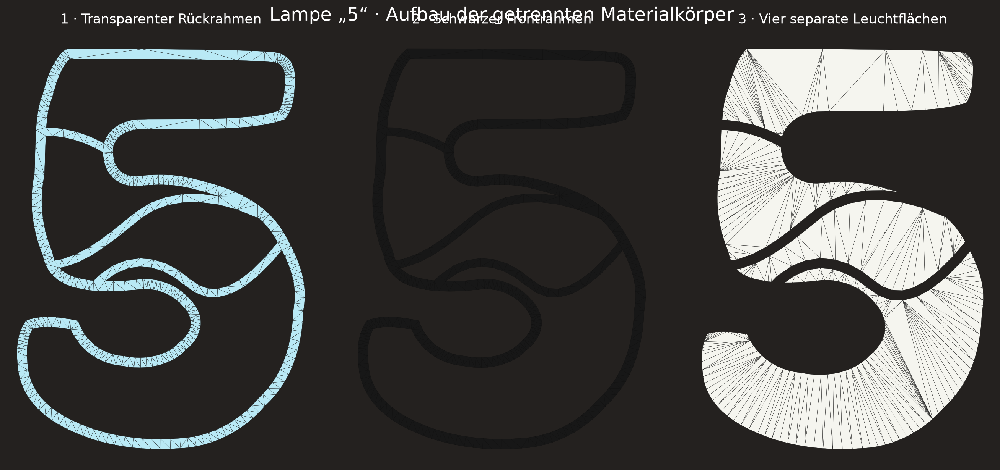
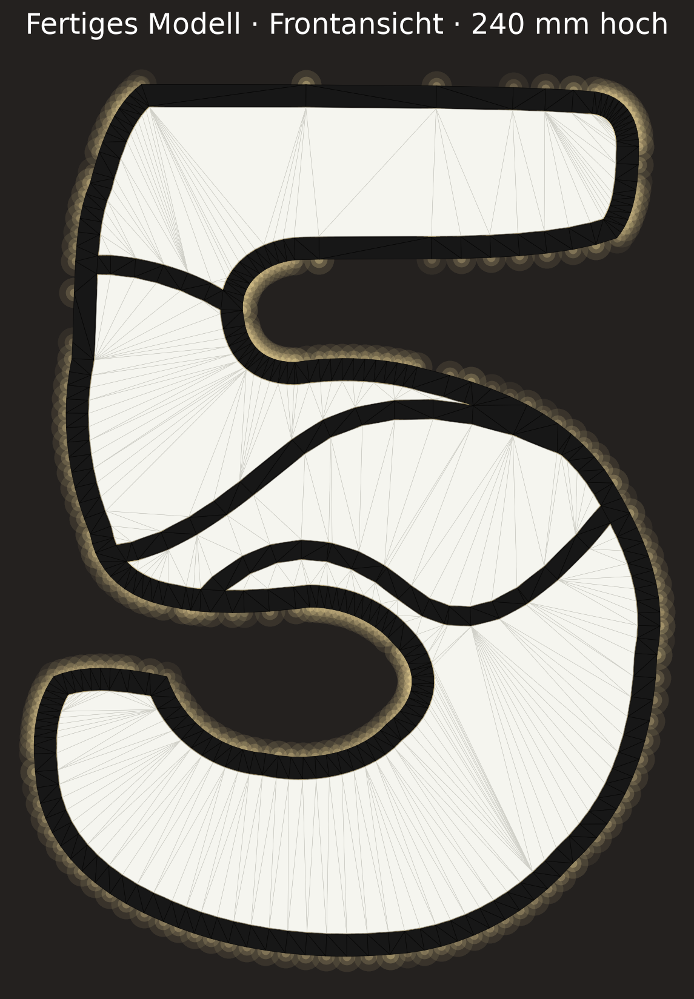
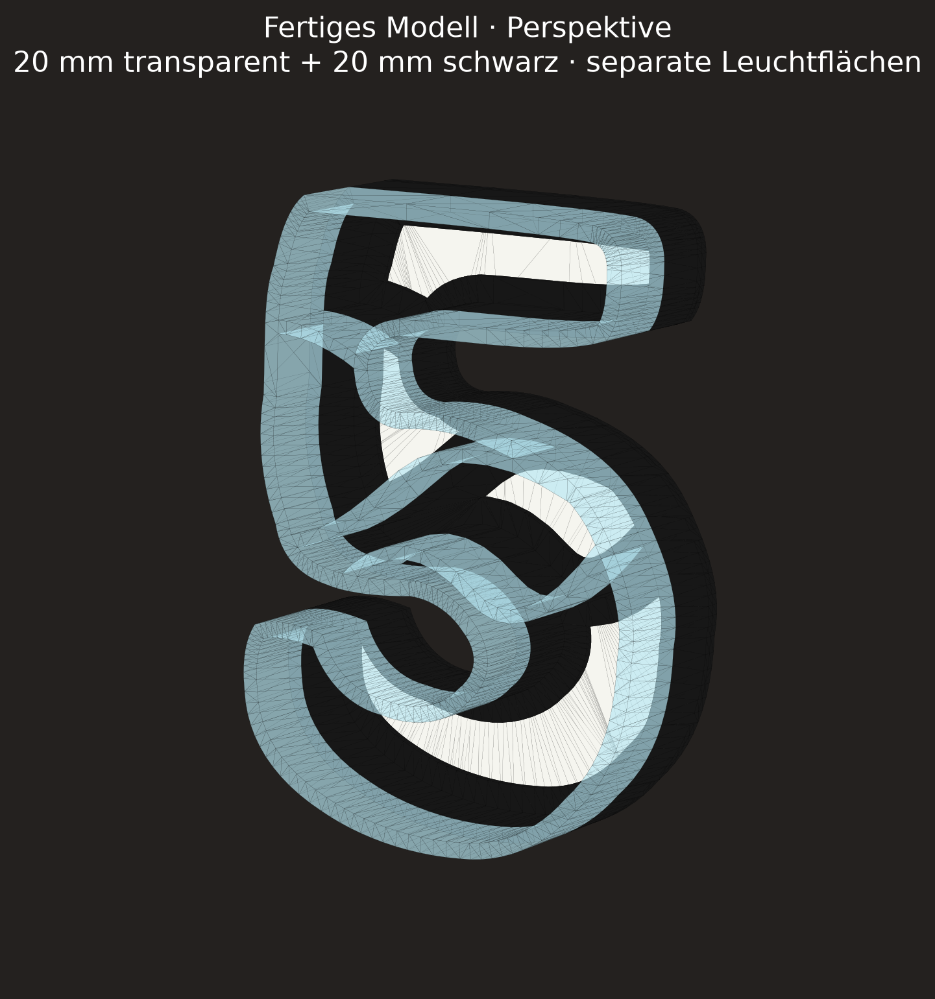

# Lampe „5“ – Maße und Annahmen

## Verbindliche Maße

| Merkmal | Wert | Quelle | Sicherheit |
| --- | ---: | --- | --- |
| Gesamthöhe | 240 mm | Nutzerangabe im PR-Kommentar | exakt |
| Gesamttiefe | 40 mm | Nutzerangabe in Issue #21 | exakt |
| Transparenter, wandseitiger Tiefenanteil | 20 mm | Nutzerangabe in Issue #21 | exakt |
| Schwarzer, frontseitiger Tiefenanteil | 20 mm | Nutzerangabe in Issue #21 | exakt |
| Auflagebreite der L-/T-Schenkel | 10 mm | Nutzerangabe „ca. 1 cm“ | nominal |
| Stromanschluss | entfällt vorerst | Nutzerkommentar in Issue #21 | exakt |
| Aufkleber/Logos | entfallen | Nutzerkommentar im PR | exakt |

## Aus dem Referenzbild abgeleitet

Der einzelne Bildanhang war über die bereitgestellte URL im Arbeitscontainer
nicht herunterladbar (der weitergeleitete Asset-Host war nicht auflösbar).
Deshalb wurde kein pixelgenauer Umriss behauptet. Der parametrisierte Umriss
übernimmt die im sichtbaren Bild eindeutigen Merkmale:

- klar lesbare Ziffer 5 mit gerundetem oberen Balken und großer unterer Rundung,
- vier weiße Leuchtfelder,
- drei geschwungene, durchgehende Trennstege,
- fließende Übergänge der Stege in den Außenrahmen,
- aus dem Bild geschätzte Breite von etwa 172 mm bei 240 mm Höhe.

## Fertigungsannahmen

| Merkmal | Wert | Status |
| --- | ---: | --- |
| Außenrahmenbreite in der Frontalebene | 6.0 mm | Bildschätzung, Testdruck empfohlen |
| Trennstegbreite in der Frontalebene | 5.0 mm | Bildschätzung, Testdruck empfohlen |
| Leuchtflächenstärke | 2.0 mm | druckbare Annahme |
| Allgemeines Spiel der Leuchtflächen | 0.30 mm | Kobra-S1-Basiswert |
| Auflagenstärke | 2.0 mm | druckbare Annahme |

Die Ausgabe `models/lampe-5.3mf` enthält getrennte Objekte und
Materialkennzeichnungen für transparent, schwarz und weiß. Die einzelnen STL
sind in Drucklage auf Z=0 abgelegt; die 3MF und die Vorschau zeigen die
zusammengesetzte Lage. Die Leuchtflächen liegen bei Z=38–40 mm auf den
schwarzen Auflagen bei Z=36–38 mm.

Rahmen und Leuchtflächen passen jeweils auf das 250 × 250 mm Druckbett. Bei
240 mm Bauteilhöhe bleiben jedoch nur 5 mm Rand pro Seite; Skirt oder Brim muss
entsprechend schmal eingestellt werden. Der schwarze Rahmenteil enthält an den
10-mm-Auflagen kurze Brücken und sollte mit aktivierter Brückenerkennung
gedruckt werden.

## Renderkontrolle

Die Ansichten werden reproduzierbar mit
`python scripts/render_lampe_5.py` aus derselben parametrischen Geometrie wie
die Druckdateien erzeugt.

