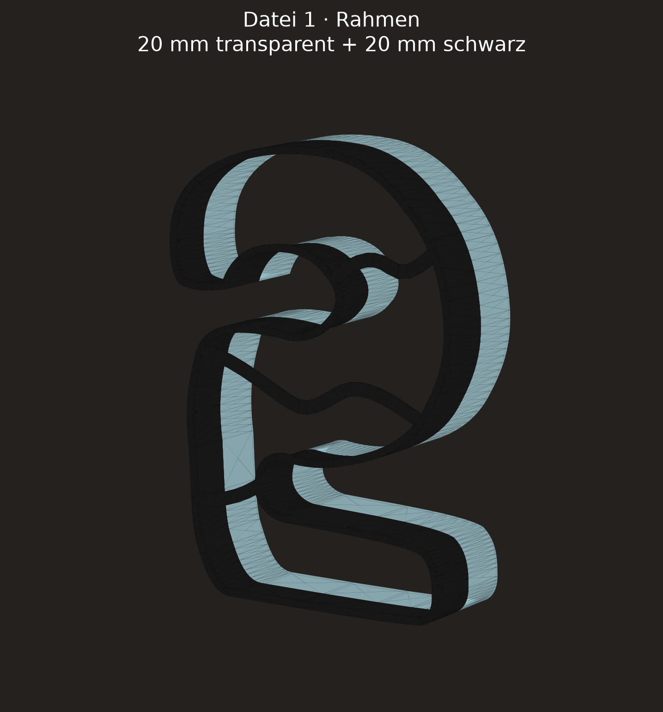
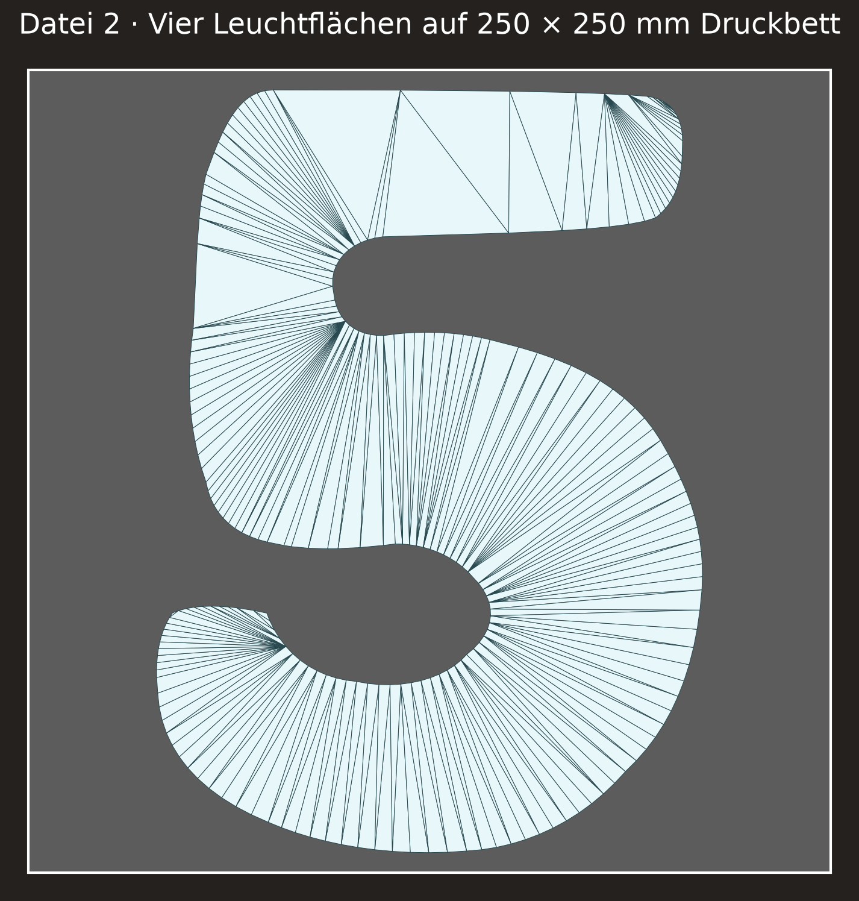

# Lampe „5“ – Maße und Annahmen

## Verbindliche Maße

| Merkmal | Wert | Quelle | Sicherheit |
| --- | ---: | --- | --- |
| Gesamthöhe | 240 mm | Nutzerangabe im PR-Kommentar | exakt |
| Rahmentiefe | 40 mm | Nutzerangabe in Issue #21 | exakt |
| Gesamttiefe montiert | 42 mm | 40 mm Rahmen + 2 mm aufliegende Leuchtfläche | exakt |
| Transparenter, wandseitiger Tiefenanteil | 20 mm | Nutzerangabe in Issue #21 | exakt |
| Schwarzer, frontseitiger Tiefenanteil | 20 mm | Nutzerangabe in Issue #21 | exakt |
| Auflagebreite der L-/T-Schenkel | 3 mm | Nutzerkorrektur 15.09.2026 | exakt |
| Stromanschluss | entfällt vorerst | Nutzerkommentar in Issue #21 | exakt |
| Aufkleber/Logos | entfallen | Nutzerkommentar im PR | exakt |

## Aus dem Referenzbild abgeleitet

Der einzelne Bildanhang war über die bereitgestellte URL im Arbeitscontainer
nicht herunterladbar (der weitergeleitete Asset-Host war nicht auflösbar).
Deshalb wurde kein pixelgenauer Umriss behauptet. Der parametrisierte Umriss
übernimmt die im sichtbaren Bild eindeutigen Merkmale:

- klar lesbare Ziffer 5 mit gerundetem oberen Balken und großer unterer Rundung,
- vier weiße Leuchtfelder,
- drei geschwungene, durchgehende Trennstege,
- fließende Übergänge der Stege in den Außenrahmen,
- aus dem Bild geschätzte Breite von etwa 172 mm bei 240 mm Höhe.

Die linke Verbindung und der mittlere Anker des unteren Trennstegs wurden am
15.09.2026 auf Nutzeranweisung weiter nach unten verlegt und als durchgehende
S-Kurve geglättet. Dadurch wird Leuchtsegment 3 größer und Leuchtsegment 4
kleiner.

Der linke Anschluss bleibt mit dem Mittelsteg verbunden; ein zuvor freier,
runder Endpunkt wurde entfernt. Die S-Kurve selbst ist kompakt zwischen diesem
Anschluss und dem tieferliegenden rechten Rahmenanschluss ausgeführt.

Die Anschlüsse des unteren Trennstegs folgen der markierten Zielansicht vom
15.09.2026: links deutlich tiefer am Außenrahmen, rechts tief in der unteren
rechten Rundung. Beide verlaufen über die Außenkontur hinaus und werden vom
Rahmen glatt beschnitten.

Der linke Anschluss wurde danach unterhalb des zuvor sichtbaren Innenstummels
an die Außenkontur verlegt; sein Steg startet außerhalb der Kontur und wird
glatt beschnitten.

Der untere Trennsteg verbindet ausschließlich die zwei vom Nutzer markierten
Anschlüsse. Seine S-Kurve ist auf diesen Zwischenraum gestaucht und schneidet
die Innenkontur nicht erneut.

Der mittlere Trennsteg ist als ausgeprägte S-Kurve mit zwei
Rahmenanschlüssen ausgeführt. Seine Anschlüsse, der Außenrahmen, die
Stegbreite und die vierteilige Leuchtflächen-Aufteilung sind dabei festgelegt;
nur die Bézier-Griffe der Kurve dürfen zur optischen Anpassung verändert
werden.

Die Auslenkung der mittleren S-Kurve wurde danach etwa halbiert, ohne die
beiden Rahmenanschlüsse oder die Segmentanzahl zu verschieben.

Die linke Rückenlinie der Ziffer wurde oberhalb des mittleren Knickpunkts
geglättet: Sie bleibt leicht geschwungen, enthält aber keine Einbuchtungen.

Die rechte Außenkontur wurde am höheren Übergang oberhalb der unteren Rundung
geglättet. Die darunterliegende Rundung bleibt unverändert, damit sie keinen
unerwünschten Bauch erhält.

Der Übergang vom oberen Balken in die rechte Außenflanke ist mit einem kurzen,
tangentialen Bogen abgerundet.

Die 3-mm-Auflagen folgen der gerundeten Offsetkontur der Rahmen- und
Trennstegstruktur. Zusätzliche positive Anschlussverstärkungen werden nicht
verwendet, damit die Auflagen an den Rahmenkontakten nicht in die
Leuchtkammern ausbeulen.
## Fertigungsannahmen

| Merkmal | Wert | Status |
| --- | ---: | --- |
| Außenrahmenbreite in der Frontalebene | 1.0 mm | Nutzerkorrektur 15.09.2026 |
| Trennstegbreite in der Frontalebene | 1.0 mm | Nutzerkorrektur 15.09.2026 |
| Leuchtflächenstärke | 2.0 mm | druckbare Annahme |
| Allgemeines Spiel der Leuchtflächen | 0.30 mm | Kobra-S1-Basiswert |
| Auflagenstärke | 2.0 mm | druckbare Annahme |

Die Ausgabe besteht aus zwei Druckdateien:

- `models/lampe-5-rahmen.3mf` enthält den transparenten Rückrahmen und den
  schwarzen Frontrahmen als getrennte Materialobjekte in gemeinsamer Lage.
- `models/lampe-5-leuchtflaechen.stl` enthält eine zusammenhängende,
  durchscheinende Leuchtplatte, die mit 0,30 mm Spiel in den Rahmen passt.

Die schwarzen Auflagen liegen bei Z=39–40 mm und schließen bündig mit der
Rahmenvorderseite ab. Die 2-mm-Leuchtfläche wird von hinten eingelegt, liegt
mit ihrer Vorderseite bei Z=38 mm an den Auflagen an und endet bei Z=36 mm.
Zwölf kleine schwarze Rastnasen an der inneren Rahmenkante liegen bei
Z=35,6–36,0 mm. Jede Nase ist eine 0,8 mm breite Wandlasche mit einem 0,6 mm
tiefen Rahmenfuß und ragt nur 0,40 mm in die Öffnung. Dadurch bleiben die
Nasen an der senkrechten Rahmeninnenseite verbunden und halten die Platte nach
dem Einrasten gegen ein Herausfallen nach hinten.
Die drei inneren Stege sind vollständig entfernt; nur ihre 1 mm hohen,
schwarzen Auflageflächen bleiben erhalten und gliedern die durchgehende
Leuchtplatte optisch. Der Außenrahmen bleibt über die volle Tiefe Z=20–40 mm
erhalten.

Für den Druck ist die Rahmen-3MF um die X-Achse gewendet: Das schwarze
Frontrahmen-Material liegt bei Z=0–20 mm auf dem Druckbett und wird zuerst
gedruckt; der transparente Rückrahmen liegt darüber bei Z=20–40 mm.

Rahmen und Leuchtflächen passen jeweils auf das 250 × 250 mm Druckbett. Bei
240 mm Bauteilhöhe bleiben jedoch nur 5 mm Rand pro Seite; Skirt oder Brim muss
entsprechend schmal eingestellt werden. Der schwarze Rahmenteil enthält an den
3-mm-Auflagen kurze Brücken und sollte mit aktivierter Brückenerkennung
gedruckt werden. Die einteilige Leuchtfläche wird zentriert gedruckt und passt
innerhalb des 250 × 250 mm Druckbetts.

## Renderkontrolle

Die Ansichten werden reproduzierbar mit
`python scripts/render_lampe_5.py` aus derselben parametrischen Geometrie wie
die Druckdateien erzeugt.

