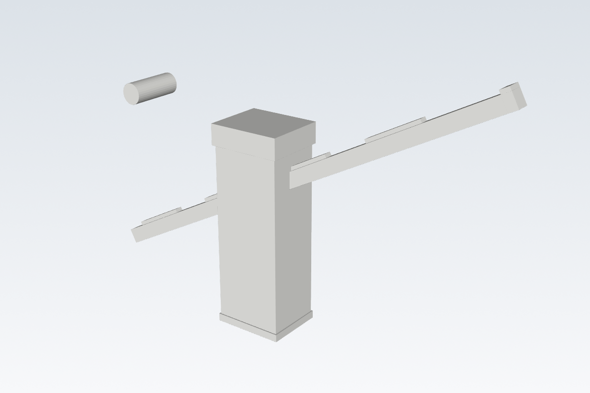

# Scheidt & Bachmann entervo.barrier AS40E – 1:50

## Modellumfang

Das Modell stellt eine Scheidt & Bachmann **entervo.barrier**, Typ **AS40E**, als
unbewegliches Schreibtisch-Dekoelement dar. Gewählt wurde die Standardausführung
mit einem 2.500-mm-Ausleger. Die Farbflächen bleiben für den ACE Pro getrennt;
die Druckdatei ist deshalb eine 3MF-Datei mit weißen, dunkelgrauen und roten
Objekten. Der Ausleger wird separat flach gedruckt und anschließend in der
gezeigten Öffnungsstellung in den Schrank geklebt.

## Maßtabelle

| Merkmal | Realmaß | Modellmaß | Ursprung | Quelle | Sicherheit | Generatorparameter |
| --- | ---: | ---: | --- | --- | --- | --- |
| Maßstab | 1:50 | – | Nutzerentscheidung | Gespräch, 2026-09-16 | exakt | `SCALE` |
| Auslegerlänge A (Standard) | 2.500 mm | 50,00 mm | Datenblatt | [entervo.barrier Produktdatenblatt, S. 2](https://www.scheidt-bachmann.de/fileadmin/images/parking-solutions/campaigns/Gated_Content_Website/RSPRODUCT_entervo.barrier_2023-11-13_de_DE.pdf#page=2) | hoch | `BOOM_LENGTH` |
| Gehäusehöhe | 1.074 mm | 21,48 mm | Datenblatt | [entervo.barrier Produktdatenblatt, S. 2](https://www.scheidt-bachmann.de/fileadmin/images/parking-solutions/campaigns/Gated_Content_Website/RSPRODUCT_entervo.barrier_2023-11-13_de_DE.pdf#page=2) | hoch | `CABINET_HEIGHT` |
| Gehäusebreite | 360 mm | 7,20 mm | Datenblatt-Zeichnung | [entervo.barrier Produktdatenblatt, S. 2](https://www.scheidt-bachmann.de/fileadmin/images/parking-solutions/campaigns/Gated_Content_Website/RSPRODUCT_entervo.barrier_2023-11-13_de_DE.pdf#page=2) | mittel; Zeichnungszuordnung visuell geprüft | `CABINET_WIDTH` |
| Gehäusetiefe | 300 mm | 6,00 mm | Datenblatt-Zeichnung | [entervo.barrier Produktdatenblatt, S. 2](https://www.scheidt-bachmann.de/fileadmin/images/parking-solutions/campaigns/Gated_Content_Website/RSPRODUCT_entervo.barrier_2023-11-13_de_DE.pdf#page=2) | mittel; Zeichnungszuordnung visuell geprüft | `CABINET_DEPTH` |
| Auslegerprofil C | 69 mm | 1,38 mm | Datenblatt | [entervo.barrier Produktdatenblatt, S. 2](https://www.scheidt-bachmann.de/fileadmin/images/parking-solutions/campaigns/Gated_Content_Website/RSPRODUCT_entervo.barrier_2023-11-13_de_DE.pdf#page=2) | hoch | `BOOM_HEIGHT` |
| Schrankkappe, Türfugen, Gelenk, Reflektorpositionen | – | siehe Skript | bildabgeleitet | vom Nutzer bereitgestelltes Produktbild; Herstellerbild `AS40e_9016_straight_closed` | niedrig bis mittel | jeweilige visuelle Konstanten |

Die offiziellen Farben sind RAL 9016 (Gehäuse), RAL 7043 (Kappe) und weißer
RAL-9010-Ausleger mit roten Reflektoren. Die angelegten 3MF-Farben sind
slicerfreundliche Näherungen, keine verbindlichen RAL-Farbprofile.

## Druck- und Montagehinweise

- **Material:** PLA, 0,4-mm-Düse.
- **Ausgabe:** `models/scheidt-bachmann-entervo-as40e-1zu50.3mf`; die
  Baugruppen liegen druckorientiert und mit getrennten Farbobjekten auf dem
  Druckbett.
- **Montage:** Den Ausleger nach dem Druck in den seitlichen Gelenksitz des
  Schranks kleben. Die offene Dekostellung ist in der separaten Vorschau-STL
  dargestellt.
- **Printability:** Alle Mindeststärken sind mindestens 0,8 mm; Schrank und
  Ausleger werden flach/stehend ohne notwendige Stützen gedruckt. Der flach
  liegende Ausleger erhält rote, 0,4-mm-hohe Einleger auf seiner Oberseite.
- **Risiko:** Der Schrankkappenverlauf, der Gelenksitz und die Reflektoren sind
  visuelle Annäherungen. Sie sind nicht fit-kritisch; für eine maßhaltige
  Reproduktion oder ein bewegliches Gelenk wären Hersteller-CAD oder
  Vor-Ort-Messungen erforderlich.

## Gerenderte Vorschau

