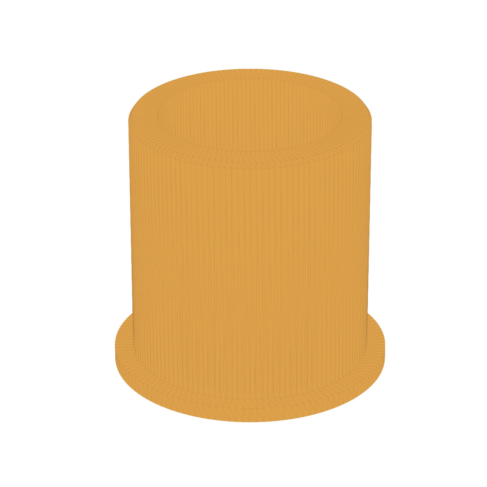

# Wäschespinne-Reduzierring – Maße

| Merkmal | Maß | Herkunft | Konfidenz |
| --- | ---: | --- | --- |
| Eindrehhülse, Innendurchmesser | 67,00 mm | Neu benutzerbestätigte Messung, 2026-09-27 (ersetzt 60,00 mm) | Hoch |
| Wäschespinnenmast, Außendurchmesser | 50,20 mm | Benutzerbestätigte Messung, 2026-09-27 (ersetzt 43/43,04 mm) | Hoch |
| Einstecktiefe | 50,00 mm | Benutzerangabe | Hoch |
| Kragen, radialer Überstand über Hülsenöffnung | 5,00 mm je Seite | Konstruktive Wahl: Überstand der bisherigen 70-mm-Kragenform über die damals angenommene 60-mm-Öffnung beibehalten | Mittel |
| Kragen, Außendurchmesser | 77,00 mm | Abgeleitet: 67,00 + 2 × 5,00 mm; verhindert das Durchrutschen durch die Hülsenöffnung | Hoch |
| Kragenhöhe | 3,00 mm | Unveränderte bisherige Benutzerentscheidung | Hoch |
| Gesamthöhe | 53,00 mm | Abgeleitet: 50,00 + 3,00 mm | Hoch |
| Passung | 0,40 mm Durchmesserspiel an beiden Kontaktflächen | Konstruktive Wahl: ASA-Gleitpassung nach Druckerprofil | Mittel |
| Ringaußendurchmesser | 66,60 mm | Abgeleitet: 67,00 − 0,40 mm | Hoch |
| Ringinnendurchmesser | 50,60 mm | Abgeleitet: 50,20 + 0,40 mm | Hoch |
| Radiale Wandstärke | 8,00 mm | Abgeleitet: (66,60 − 50,60) / 2 mm | Hoch |
| Einführfase außen | 1,00 mm am hülsenseitigen Ende | Konstruktive, nicht fit-kritische Wahl | Mittel |
| Einlaufrundung innen | Radius 1,00 mm an der mastseitigen Kragenfläche | Benutzerwunsch, rot markierte Kante im Referenzbild | Hoch |

## Befund zum ersten Druck

Die neu bestätigten Maße vom 2026-09-27 ersetzen die bisherige 60-mm-Hülsenannahme:
**50,20 mm Mast-Außendurchmesser** und **67,00 mm Hülsen-Innendurchmesser**.
Der bisherige Wert 60,00 mm ist für dieses Teil nicht mehr gültig. Noch ältere
Werte (43,00/43,04 mm Mast, 53,00/60,48 mm Hülse) stammten aus Fotoablesungen
und sind ebenfalls ungültig.

Die Kacheln 02 und 03 zeigen den schwarzen Fehldruck. Die abgelesenen Maße
35,85 mm und 52,11 mm werden nicht als Bauteilmaße verwendet. Beim erneuten Druck
muss die Slicer-Skalierung auf 100 % stehen.

## Einbaurichtung

Der Kragen (77 mm Außendurchmesser, 3 mm Höhe) liegt mit 5 mm radialem Überstand
auf der Oberkante der 67-mm-Hülse auf
und verhindert, dass der Ring hineinrutscht. Der 50-mm-Zylinder zeigt in die
Hülse; der 50,20-mm-Mast wird von der Kragenseite durch die innenliegende
Einlaufrundung (R1) eingeschoben.

## Druckvorgabe

Material: ASA. Der Ring ist ein lasttragendes Funktionsteil, einfarbig und wird als
ASCII-STL erzeugt. Druck auf einer Stirnseite, mit mindestens fünf Perimetern und
**50 % Füllung im Slicer; nicht mit 100 % massiv drucken.** Empfohlen ist ein
rectilineares oder gyroides Füllmuster. Den Kragen auf dem Druckbett ausrichten. Nach dem Druck
das Teil umdrehen: Der lange Zylinder wird in die Hülse eingesetzt, der Kragen bleibt
oben auf der Hülsenkante und der Mast wird durch den Kragen eingeschoben. Die
Geometrie enthält keine unterstützungspflichtigen Überhänge.

Vor dem vollständigen Neudruck empfiehlt sich ein 8-10 mm hoher Passungsprobekörper
mit denselben Innen- und Außendurchmessern. Bleibt die Hülse durch Rost, Naht oder
Ovalität lokal enger, kann das Durchmesserspiel anschließend parametrisch erhöht
werden.

## Generierung und Prüfung

`.\.venv\Scripts\python.exe scripts\waeschespinne_reduzierring.py` erzeugt
`models/waeschespinne-reduzierring-67-50.2.stl` als ASCII-STL. Die Prüfung mit
`.\.venv\Scripts\python.exe scripts\mesh_tool.py validate models\waeschespinne-reduzierring-67-50.2.stl`
meldet PASS: 4.608 Facetten, wasserdicht/manifold, konsistente Wicklung,
Euler-Zahl 0 und null degenerierte Dreiecke; Bauraum 77 × 77 × 53 mm.
`.\.venv\Scripts\python.exe scripts\mesh_tool.py overhang models\waeschespinne-reduzierring-67-50.2.stl`
meldet 126,68 mm² Überhangfläche (0,5 %), keine Decken/Brücken. Die kleine
Überhangfläche der Einlaufrundung am Bett ist ohne Stützen druckbar; ein
Passungsprobedruck bleibt wegen ASA-Schrumpfung und möglicher Hülsenovalität nötig.
